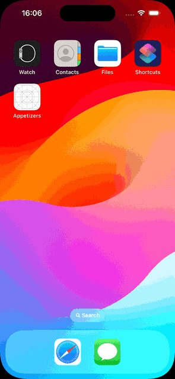

---
# Appetizers
SwiftUI-based iOS application with 3 screens: Menu, Order(Bag) and Account. The app parses a JSON to dynamically load the data from a remote server, showing each product's details (name, price, details) and the images are downloaded asynchronously.

This project helped me familiarise and practice with concepts such as: `EnvironmentObject` & `StateObject`, `AppStorage`, `FocusState`, `async/await`; as well as designing an UI

## GIF

